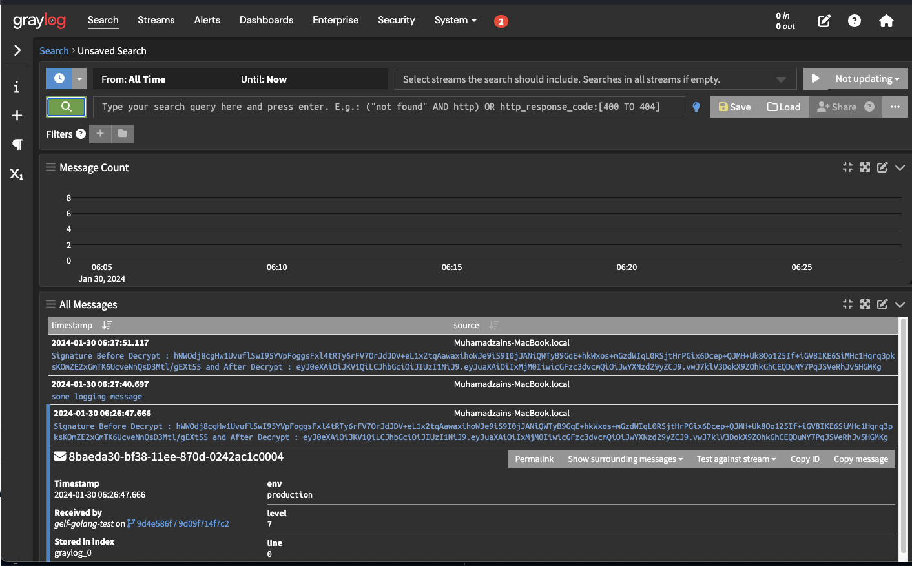

## Usage

The hook must be configured with:

- A Graylog GELF UDP address (a "ip:port" string).
- an optional hash with extra global fields. These fields will be included in all messages sent to Graylog

```go
package main

import (
    log "github.com/sirupsen/logrus"
    "github.com/gemnasium/logrus-graylog-hook/v3"
    )

func main() {
    hook := graylog.NewGraylogHook("<graylog_ip>:<graylog_port>", map[string]interface{}{"this": "is logged every time"})
    log.AddHook(hook)
    log.Info("some logging message")
}
```

### Asynchronous logger

```go
package main

import (
    log "github.com/sirupsen/logrus"
    "github.com/gemnasium/logrus-graylog-hook/v3"
    )

func main() {
    hook := graylog.NewAsyncGraylogHook("<graylog_ip>:<graylog_port>", map[string]interface{}{"this": "is logged every time"})
    // NOTE: you must call Flush() before your program exits to ensure ALL of your logs are sent.
    // This defer statement will not have that effect if you write it in a non-main() method.
    defer hook.Flush()
    log.AddHook(hook)
    log.Info("some logging message")
}
```

## Example

[](https://gitlab.com/zainal21/go-gelf-logger)
